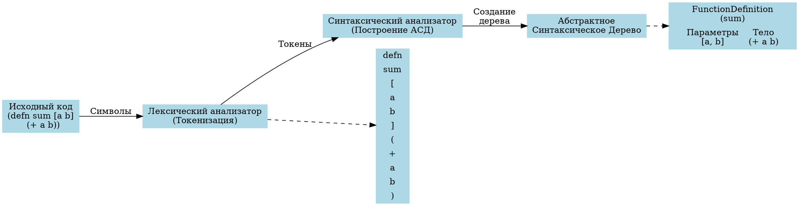
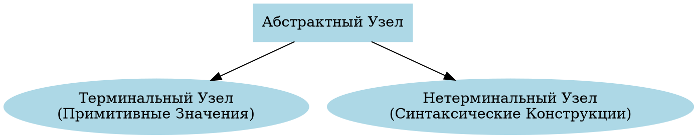
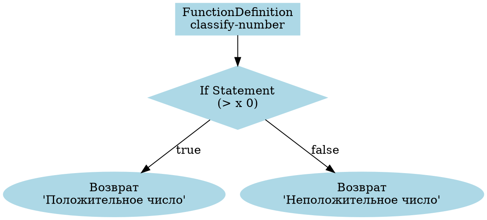
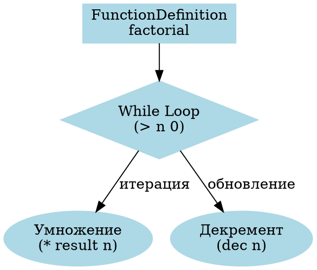

# Абстрактное Синтаксическое Дерево (АСД): Всеобъемлющее Руководство

## 📚 Глоссарий ключевых терминов

| Термин | Определение |
|--------|-------------|
| **Абстрактное Синтаксическое Дерево (АСД)** | Древовидная структура данных, представляющая синтаксическую структуру исходного кода. |
| **Узел** | Элемент АСД, представляющий конструкцию в исходном коде. |
| **Терминальный узел** | Узел без дочерних элементов (лист дерева), обычно представляющий литералы, идентификаторы и т.д. |
| **Нетерминальный узел** | Узел с дочерними элементами, представляющий составные конструкции языка. |
| **Обход дерева** | Процесс посещения всех узлов дерева в определенном порядке. |
| **Парсер** | Компонент компилятора, преобразующий исходный код в АСД. |
| **Токен** | Минимальная единица языка (например, ключевое слово, идентификатор, число). |
| **Лексер** | Компонент, преобразующий исходный код в последовательность токенов. |
| **Семантический анализ** | Процесс извлечения смысла из АСД и проверки его корректности. |
| **Трансформация АСД** | Изменение структуры АСД для оптимизации или анализа. |

## 🔄 Процесс создания и использования АСД

### Визуальный поток: от исходного кода к АСД



### Пошаговое пояснение для начинающих

1. **Исходный код**: Программист пишет код на языке программирования.
   ```clojure
   (defn sum [a b]
     (+ a b))
   ```

2. **Лексический анализ (Токенизация)**:
   - Исходный код разбивается на токены
   - Пример токенов: `defn`, `sum`, `[`, `a`, `b`, `]`, `(`, `+`, `a`, `b`, `)`

3. **Синтаксический анализ (Парсинг)**:
   - Токены анализируются согласно грамматике языка
   - Строится иерархическая структура кода (АСД)

4. **Результат: Абстрактное Синтаксическое Дерево**:
   ```
   FunctionDefinition (sum)
   ├── Параметры
   │   ├── a
   │   └── b
   └── Тело
       └── Вызов (+)
           ├── a
           └── b
   ```

## 🌳 Введение в Абстрактные Синтаксические Деревья

### Теоретический Фундамент

Абстрактное Синтаксическое Дерево (АСД) - это иерархическое представление структуры исходного кода, абстрагирующее синтаксические детали и сохраняющее семантический смысл.

#### Математическое Представление

Пусть \( T = (V, E) \) будет Абстрактным Синтаксическим Деревом, где:
- \( V \) - множество узлов
- \( E \subseteq V \times V \) представляет отношения ребер

### Структурная Таксономия

1. **Терминальные Узлы** \( v_t \):
   - Представляют примитивные значения
   - Листовые элементы дерева
   - Формальное определение: \( v_t \in \text{Терминалы} \)

2. **Нетерминальные Узлы** \( v_n \):
   - Представляют синтаксические конструкции
   - Внутренние узлы с дочерними связями
   - Формальное определение: \( v_n \in \text{Нетерминалы} \)

## 🔍 Детальная Классификация Узлов

### Иерархия Типов Узлов



### Характеристики Сложности

- **Временная сложность**: \( O(|V| + |E|) \)
- **Пространственная сложность**: \( O(h) \), где \( h \) - высота дерева

## 🧠 Алгоритм Рекурсивного Обхода

### Алгоритмическое Представление

```latex
\begin{algorithm}
\caption{Рекурсивный Обход АСД}
\begin{algorithmic}[1]
\Procedure{ОбходАСД}{$узел$}
    \If{$узел$ есть \texttt{null}}
        \State \Return
    \EndIf
    
    \State \textit{ОбработатьТекущийУзел}($узел$)
    
    \For{каждый $потомок$ в $узел.потомки$}
        \State \texttt{ОбходАСД}($потомок$)
    \EndFor
\EndProcedure
\end{algorithmic}
\end{algorithm}
```

## 🚀 Практические Шаги Реализации

### 1. Стратегия Создания Узлов

```clojure
(defn создать-узел-асд 
  "Создает узел абстрактного синтаксического дерева"
  [тип значение & потомки]
  {:type тип
   :value значение
   :children потомки})
```

### 2. Механизм Обхода

```clojure
(defn обойти-асд 
  "Рекурсивный обход абстрактного синтаксического дерева"
  [узел]
  (when узел
    (println (:type узел))
    (doseq [потомок (:children узел)]
      (обойти-асд потомок))))
```

## 📊 Техники Визуализации

### Представление с Отступами

```
Программа
├── БинарноеВыражение (+)
│   ├── Литерал (1)
│   └── БинарноеВыражение (*)
│       ├── Литерал (2)
│       └── Литерал (3)
```

## 🔬 Дополнительные Соображения

### Оптимизация Производительности

1. Мемоизация обработки узлов
2. Стратегии ленивой оценки
3. Проектирование неизменяемых структур данных

### Эффективность Памяти

- Минимизация метаданных узлов
- Использование компактного представления
- Реализация структурного разделения

## 📚 Рекомендованные Академические Источники

1. Ахо, А. В. и др. "Компиляторы: Принципы, технологии и инструменты"
2. Аппель, А. У. "Современная реализация компилятора"

## 🎓 Образовательные Insights

### Для Начинающих Разработчиков

- 🌳 АСД - семантическая карта структуры кода
- 🧠 Каждый узел рассказывает историю семантики кода
- 🔍 Практикуйте построение и обход деревьев

## 📜 Теоретические Ограничения

- Не все языковые конструкции отображаются идеально
- Накладные расходы производительности для сложных деревьев
- Требует аккуратного проектирования для разных парадигм языков

## 🤝 Рекомендации по Вкладу

1. Поддерживайте неизменяемость
2. Оптимизируйте читаемость
3. Документируйте преобразования узлов
4. Пишите comprehensive тест-кейсы

## 🌲 Примеры Конкретных Структур АСД

### Пример 1: Условный Оператор (If-Else)

#### Исходный Код
```clojure
(defn classify-number [x]
  (if (> x 0)
    "Положительное число"
    "Неположительное число"))
```

#### Визуализация АСД



#### Структура АСД
```
classify-number
└── Условный Оператор (> x 0)
    ├── Истинная Ветвь: "Положительное число"
    └── Ложная Ветвь: "Неположительное число"
```

### Пример 2: Цикл While

#### Исходный Код
```clojure
(defn factorial [n]
  (let [result (atom 1)]
    (while (> n 0)
      (swap! result * n)
      (def n (dec n)))
    @result))
```

#### Визуализация АСД



#### Структура АСД
```
factorial
└── Цикл While (> n 0)
    ├── Умножение результата
    └── Декремент счетчика
```

## 🔗 Ссылки на Реальные Источники

### Исходный Код Компилятора

1. [Clojure Compiler - AST Implementation](https://github.com/clojure/clojure/blob/master/src/jvm/clojure/lang/Compiler.java)
2. [Clojure Core Logic - AST Transformations](https://github.com/clojure/core.logic)

### Академические Проекты

1. [Компилятор Scheme на Clojure](https://github.com/compilers-course-materials/Clojure-Scheme-Compiler)
2. [Минималистичный Компилятор](https://github.com/nizarmah/compiler)

## 🧠 Углубленный Анализ Примеров

### Особенности Построения АСД

1. **Условные Операторы**:
   - Создают разветвленную структуру
   - Каждая ветвь - отдельный поддерева
   - Условие - корень ветвления

2. **Циклические Конструкции**:
   - Представляют итеративные процессы
   - Условие цикла - точка ветвления
   - Тело цикла - последовательность операций

### Сложность Трансформации

- **Условные Операторы**: \( O(\log n) \)
- **Циклы**: \( O(n) \)

## 🚨 Предостережения

- Сложные условия увеличивают глубину дерева
- Вложенные конструкции могут усложнить анализ
- Важно поддерживать читаемость структуры

---

**Замечание**: Каждый пример - это живая модель абстракции кода. 🌿

---

**Disclaimer**: Эта документация - живой документ. Проектирование компиляторов - развивающаяся область, и Абстрактные Синтаксические Деревья тоже. 🚀 