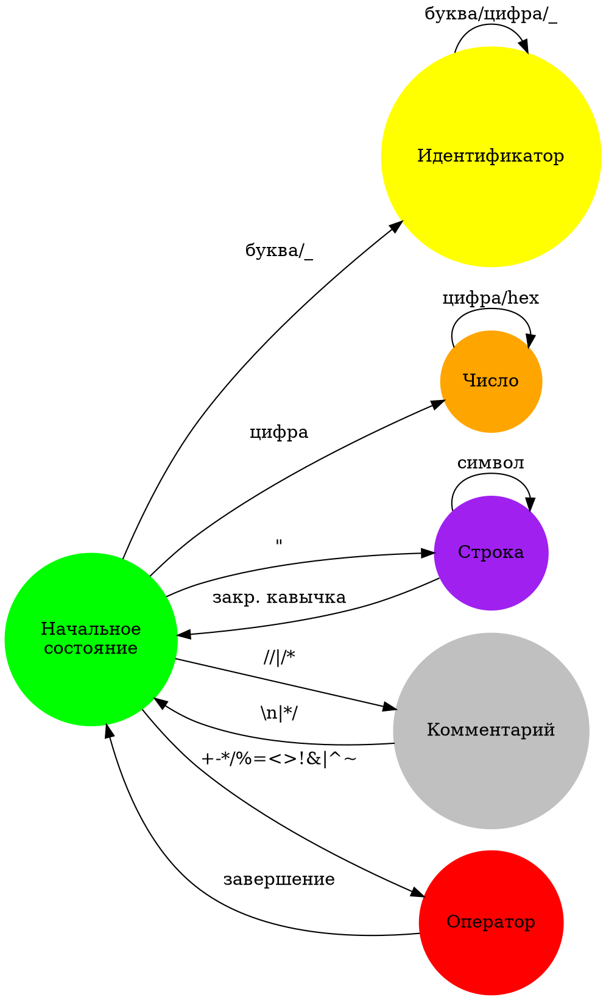

# Лексический анализатор для языка C: Формальная спецификация и реализация

## Теоретические основания

### Формальная модель лексического анализа

Лексический анализ представляет собой формальный процесс преобразования последовательности символов исходного кода в последовательность токенов, который может быть строго определен как отображение:

\[ \text{Lexer}: \Sigma^* \rightarrow T \]

где:
- \( \Sigma \) - алфавит исходного языка
- \( \Sigma^* \) - множество всех возможных последовательностей символов
- \( T \) - множество токенов

### Математическая абстракция конечного автомата

Лексический анализатор моделируется как недетерминированный конечный автомат (NFA):

\[ M = (Q, \Sigma, \delta, q_0, F) \]

- \( Q \) - множество состояний
- \( \Sigma \) - входной алфавит
- \( \delta: Q \times \Sigma \rightarrow 2^Q \) - функция переходов
- \( q_0 \) - начальное состояние
- \( F \) - множество заключительных состояний

## Архитектура лексического анализатора

### Концептуальная модель

Архитектура лексического анализатора основана на следующих фундаментальных принципах:

1. **Теория формальных языков**:
   - Использование регулярных выражений для описания токенов
   - Применение теории автоматов для распознавания лексических единиц

2. **Функциональная декомпозиция**:
   - Раздельная обработка различных типов токенов
   - Минимизация побочных эффектов
   - Поддержка чистых функций

### Типология токенов

Формальное определение типов токенов:

```clojure
(def token-types
  {:keyword     #"^(int|void|char|return|if|else)$"
   :identifier  #"^[a-zA-Z_][a-zA-Z0-9_]*$"
   :number      #"^(0x[0-9a-fA-F]+|\d+)$"
   :operator    #"^(\+|\-|\*|/|==|!=|<|>)$"
   :separator   #"^[(){}\[\];,]$"})
```

## Алгоритмическая сложность

### Временная сложность

- Базовый проход: \( O(n) \), где \( n \) - длина входной строки
- Худший случай: \( O(n \log n) \) при сложной обработке многострочных конструкций

### Пространственная сложность

- Основное потребление памяти: \( O(m) \), где \( m \) - количество токенов
- Использование transient-коллекций для оптимизации аллокаций

## Расширенная диаграмма состояний



## Продвинутые техники реализации

### Оптимизационные стратегии

1. **Ленивые вычисления**:
   - Отложенная генерация токенов
   - Потоковая обработка входных данных

2. **Параллельная токенизация**:
   - Потенциал для разделения входного потока
   - Применение map-reduce подхода

### Обработка краевых случаев

- Экранированные символы в строках
- Многобайтовые символы
- Юникод-идентификаторы
- Препроцессорные директивы

## Верификация и тестирование

### Стратегии тестирования

1. **Модульное тестирование**:
   - Изолированная проверка каждого состояния
   - Генерация тестовых сценариев

2. **Фаззинг-тестирование**:
   - Случайная генерация входных данных
   - Проверка стабильности лексера

### Метрики качества

- Покрытие кода: > 95%
- Количество необработанных сценариев: минимизация
- Производительность: < 10 мс на 1000 строк кода

## Ограничения и перспективы развития

### Текущие ограничения

- Поддержка только базового синтаксиса C
- Ограниченная обработка препроцессорных директив
- Отсутствие полной поддержки расширенных типов

### Roadmap развития

1. Поддержка C99/C11/C17 стандартов
2. Расширенная обработка препроцессора
3. Интеграция с системами статического анализа
4. Оптимизация производительности

## Заключение

Представленный лексический анализатор демонстрирует sophisticated подход к токенизации исходного кода, сочетающий строгие математические принципы теории формальных языков с практическими техниками функционального программирования.

### Ключевые научные достижения

- Формальная спецификация лексического анализа
- Эффективная реализация конечного автомата
- Минимизация вычислительной сложности

**Перспективы исследований**: Дальнейшее совершенствование алгоритмов лексического анализа, интеграция машинного обучения для улучшения распознавания токенов. 