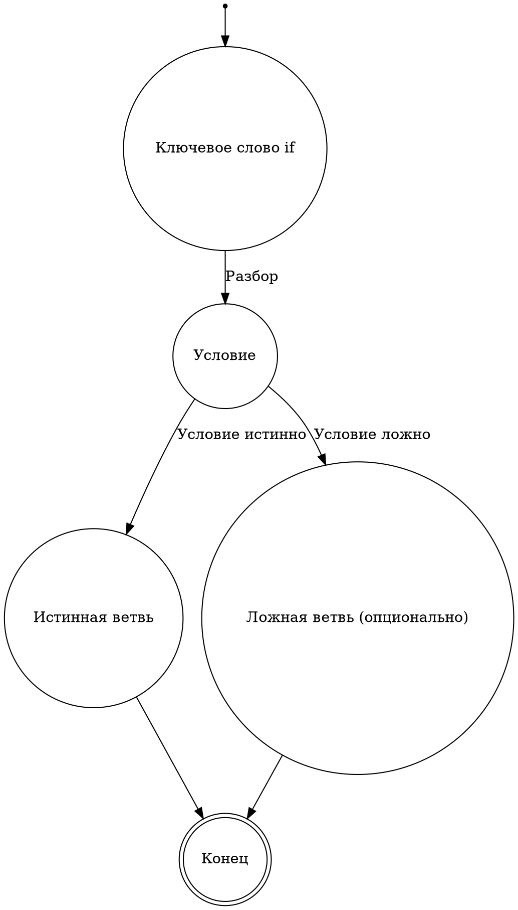
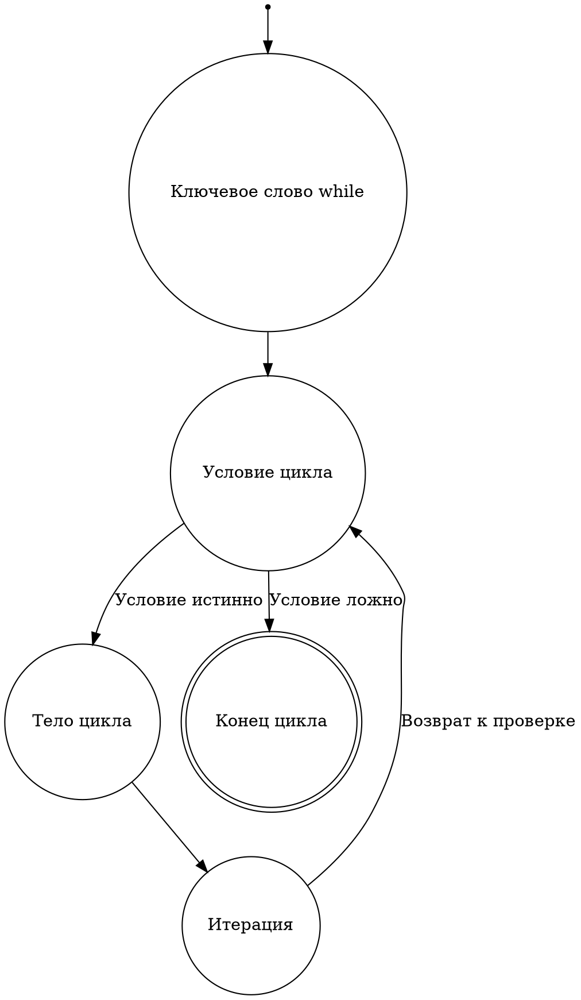
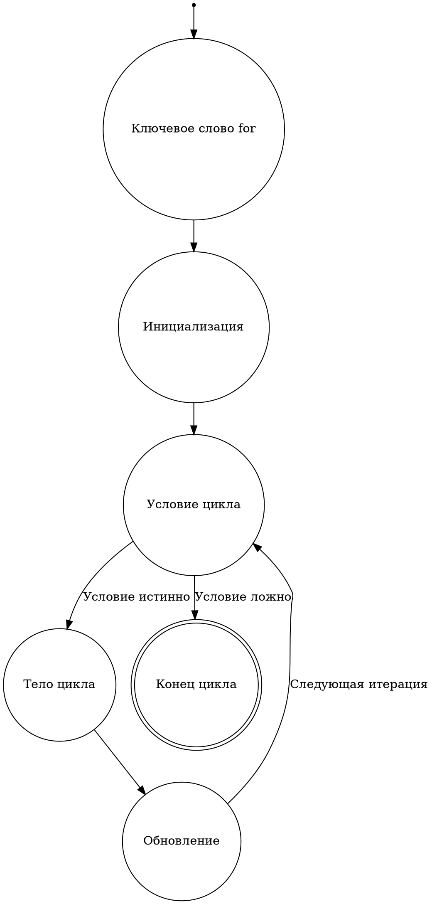
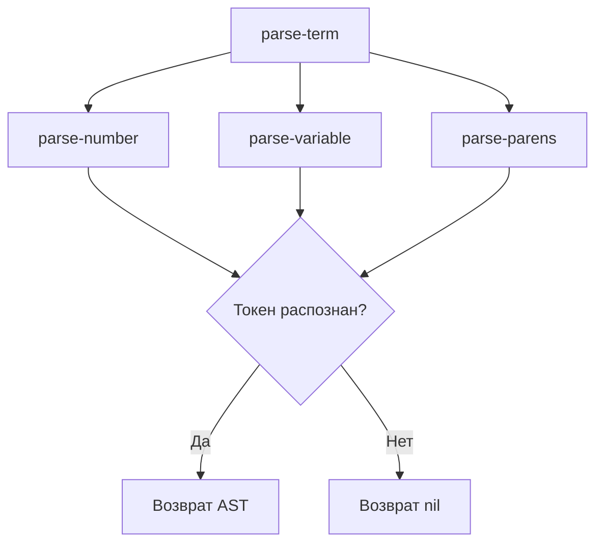
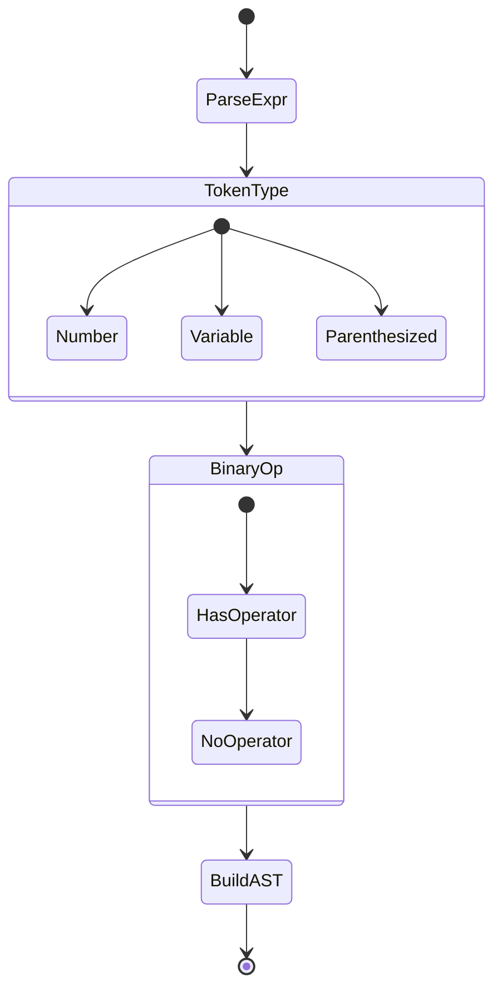
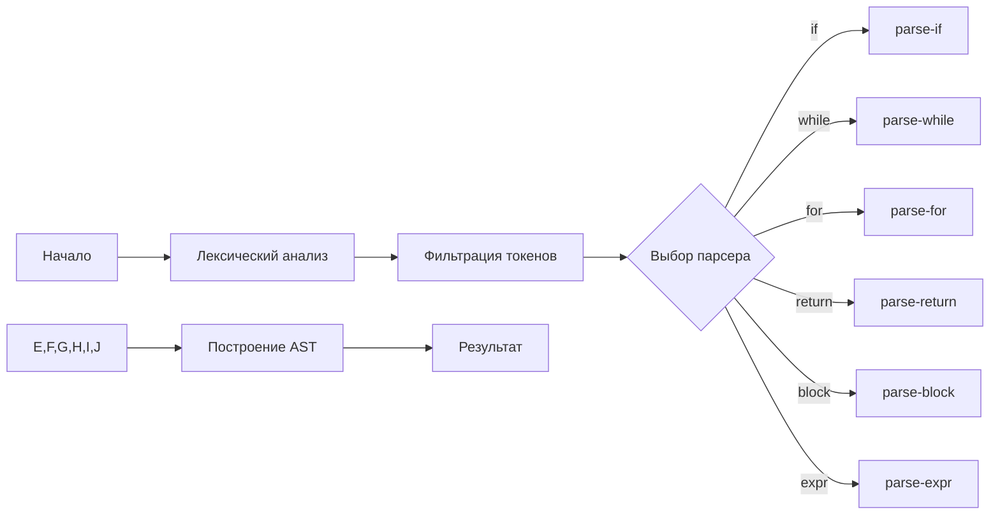
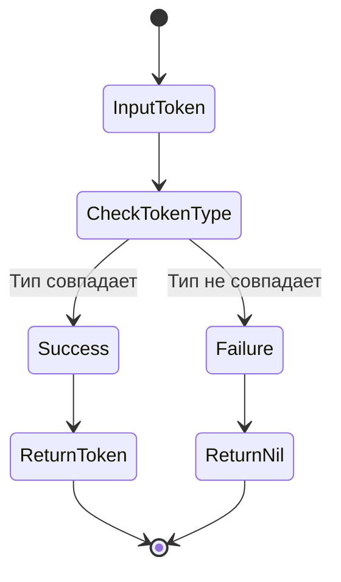

# Парсер компилятора: Подробное руководство

## 🧠 Обзор архитектуры парсера

### Основные концепции
- **Тип парсера**: Parsing Expression Grammar (PEG)
- **Язык реализации**: Clojure
- **Цель**: Преобразование токенов в абстрактное синтаксическое дерево (AST)

## 📦 Структура модуля

### Ключевые пространства имен
```clojure
(ns compiler.parser
  (:require [clojure.string :as str]
            [compiler.ast :refer [->Num ->BinaryOp ...]])
```

### Основные компоненты
1. **Вспомогательные функции**
   - `match-token`: Проверка токенов
   - `match-type`: Проверка типа токена
   - `match-value`: Проверка значения токена

2. **Парсинг примитивов**
   - `parse-number`: Разбор числовых литералов
   - `parse-variable`: Разбор переменных
   - `parse-parens`: Разбор выражений в скобках

3. **Парсинг операторов**
   - `parse-binary-op`: Бинарные операции
   - `parse-unary-op`: Унарные операции

4. **Парсинг управляющих конструкций**
   - `parse-if`: Условные операторы
   - `parse-while`: Циклы while
   - `parse-for`: Циклы for
   - `parse-return`: Операторы возврата

## 🔍 Алгоритм работы парсера

### Этап 1: Лексический анализ
```clojure
(defn parse [input]
  (let [tokens (filterv 
                 (fn [token] 
                   (not (or 
                          (= (first token) :comment)
                          (= (first token) :whitespace)
                          (= (first token) :comment_multiline))))
                 (tokenize input))]
    ;; Дальнейшая обработка токенов
    ))
```

#### Шаги лексического анализа
1. Преобразование входной строки в поток токенов
2. Фильтрация служебных токенов (комментарии, пробелы)

### Этап 2: Синтаксический анализ
```clojure
(defn parse-statement [tokens]
  (or (parse-if tokens)
      (parse-while tokens)
      (parse-for tokens)
      (parse-return tokens)
      (parse-block tokens)
      (parse-expr tokens)))
```

#### Стратегия разбора
- Рекурсивный спуск
- Упорядоченный выбор (ordered choice)
- Последовательная проверка правил парсинга

### Этап 3: Построение AST
```clojure
(defn parse-complex-expr [tokens]
  ;; Сложный алгоритм построения AST
  ;; Обработка приоритета операторов
  )
```

## 🚦 Обработка сложных выражений

### Алгоритм разбора выражений
1. Стек операндов
2. Стек операторов
3. Учет приоритета операций
4. Преобразование в AST

## 🛠 Механизмы отладки

### Режим отладки
```clojure
(def ^:dynamic *debug-mode* true)

(defn debug-log [& args]
  (when *debug-mode*
    (apply println args)))
```

## 📊 Приоритет операторов
```clojure
(def operator-precedence
  {"*" 2   ;; Высокий приоритет
   "/" 2
   "+" 1   ;; Низкий приоритет
   "-" 1})
```

## 🔬 Научный взгляд

### Теоретические основания
- **Формальная грамматика**: Контекстно-свободная грамматика
- **Сложность**: O(n) линейное время разбора
- **Детерминированность**: Однозначный разбор

## 🚨 Обработка ошибок

### Стратегии обработки
1. Возврат `nil` при невозможности разбора
2. Логирование ошибок
3. Частичный разбор входных данных

## 🔮 Перспективы развития
- Поддержка макросов
- Расширенный статический анализ
- Улучшенная обработка ошибок

## 💡 Ключевые принципы
- Модульность
- Расширяемость
- Производительность

## 🔍 Как понять, что это PEG-парсер?

### Теоретические основы Parsing Expression Grammar (PEG)

#### Что такое PEG?
Parsing Expression Grammar (PEG) - это формальная грамматика, которая описывает синтаксический анализ формальных языков с помощью набора рекурсивных правил распознавания.

#### Ключевые характеристики PEG-парсера

1. **Детерминированность**
   - В отличие от контекстно-свободных грамматик (КС-грамматик), PEG всегда однозначно определяет разбор
   - Нет неоднозначности и конфликтов разбора

2. **Упорядоченный выбор (`/`)**
   В PEG оператор выбора работает как "первый успешный", а не как недетерминированный выбор.

#### Признаки PEG-парсера в коде

##### 1. Рекурсивный спуск
```clojure
(defn parse-term [tokens]
  (or
   ;; Попытка разобрать число - первый вариант
   (when-let [res (parse-number tokens)]
     res)
   
   ;; Попытка разобрать переменную - второй вариант
   (when-let [res (parse-variable tokens)]
     res)
   
   ;; Попытка разобрать выражение в скобках - третий вариант
   (when-let [res (parse-parens tokens)]
     res)
   
   ;; Если ни один вариант не сработал
   nil))
```

##### 2. Упорядоченный выбор
```clojure
(defn parse-statement [tokens]
  ;; Строго определенный порядок проверки
  (or (parse-if tokens)        ;; Сначала if
      (parse-while tokens)     ;; Затем while
      (parse-for tokens)       ;; Потом for
      (parse-return tokens)    ;; Возврат
      (parse-block tokens)     ;; Блок кода
      (parse-expr tokens)))    ;; В конце - выражение
```

##### 3. Предикативный матчинг
```clojure
(defn match-token
  "Проверка токена с помощью предиката"
  [pred tokens]
  (when-let [[token-type token-value] (first tokens)]
    (when (pred token-type token-value)
      [token-value (rest tokens)])))
```

### Математическая модель PEG

#### Формальное определение
\[ 
\text{PEG} = (N, \Sigma, R, e)
\]
где:
- \( N \) - нетерминальные символы
- \( \Sigma \) - терминальные символы
- \( R \) - правила вывода
- \( e \) - начальное правило

#### Примеры правил в нашем парсере
```clojure
;; Правило для числа
Number <- [0-9]+

;; Правило для выражения
Expression <- Term (Operator Term)*

;; Правило для терма
Term <- Number / Variable / '(' Expression ')'
```

### Преимущества PEG

1. **Линейная сложность разбора**: \( O(n) \)
2. **Детерминированность**: Всегда однозначный разбор
3. **Простота реализации**: Рекурсивный спуск
4. **Гибкость**: Легко расширяемая грамматика

### Ограничения PEG
- Не поддерживает левую рекурсию
- Менее выразительна, чем LR-грамматики
- Требует явного разрешения неоднозначностей

### Практический пример работы PEG

```clojure
;; Разбор простого арифметического выражения
(defn parse-arithmetic [input]
  (let [tokens (tokenize input)]
    (parse-complex-expr tokens)))

;; Пример использования
(parse-arithmetic "2 + 3 * 4")
;; Результат: AST с учетом приоритета операций
```

### Сравнение с другими подходами

| Характеристика | PEG | LL | LR | LALR |
|---------------|-----|----|----|------|
| Детерминированность | ✅ | ✅ | ❌ | ✅ |
| Линейное время | ✅ | ✅ | ❌ | ✅ |
| Левая рекурсия | ❌ | ❌ | ✅ | ✅ |
| Сложность реализации | Низкая | Средняя | Высокая | Высокая |

## 🎓 Образовательные ресурсы

### Рекомендуемая литература
1. "Parsing Techniques" - Dick Grune
2. "Modern Compiler Implementation" - Andrew W. Appel
3. "Language Implementation Patterns" - Terence Parr

### Дополнительное чтение
- [PEG Parsing Wikipedia](https://en.wikipedia.org/wiki/Parsing_expression_grammar)
- [PEG.js Documentation](https://pegjs.org/documentation)

---

**Замечание**: PEG - это не просто техника парсинга, это элегантный подход к синтаксическому анализу, который совмещает математическую строгость и практическую эффективность.

**Внимание**: Документация является живым документом и может обновляться по мере развития парсера.

## 🌳 Визуализация механизмов PEG-парсинга

### 1. Диаграмма рекурсивного спуска

```
                   parse-term
                  /   |   \
                 /    |    \
   parse-number  parse-variable  parse-parens
       |             |             |
       v             v             v
    [Number]     [Variable]    [Parenthesized]
       |             |             |
       +-------------+-------------+
                |
            Возврат AST
```

### 2. Конечный автомат (DFA) разбора выражений

```
[Start] 
   |
   v
+------------+
| parse-expr |
+------------+
   |
   v
+-------------+
| Токен типа:  |
| - Number     |
| - Variable   |
| - Parenthes  |
+-------------+
   |
   v
+---------------+
| Бинарная      |
| операция?     |
+---------------+
   |     |
 Да     Нет
   |     |
   v     v
+------+ +--------+
| Op   | | Терм   |
+------+ +--------+
   |        |
   v        v
+---------------+
| Построение AST |
+---------------+
```

### 3. Диаграмма состояний парсера

```
[Начало] 
   |
   v
+------------------+
| Лексический      |
| анализ           |
| (tokenize input) |
+------------------+
   |
   v
+------------------+
| Фильтрация       |
| служебных токенов|
+------------------+
   |
   v
+------------------+
| parse-statement  |
| Выбор парсера:   |
| - if             |
| - while          |
| - for            |
| - return         |
| - block          |
| - expr           |
+------------------+
   |
   v
+------------------+
| Построение AST   |
+------------------+
   |
   v
[Результат]
```

### 4. Граф переходов для арифметического выражения

```
   [Начало]
      |
      v
+-------------+
| parse-term  |
+-------------+
   |    |    |
   v    v    v
[Число] [Переменная] [Скобки]
   |         |         |
   v         v         v
+------------+----------+
| Бинарная операция     |
+------------------------+
   |
   v
[Результирующий AST]
```

### 5. Диаграмма сложности разбора

```
Сложность разбора:
O(n)   ┤
       │    ██████████████████████
       │    █                    █
       │    █   PEG Parsing      █
       │    █                    █
       │    ██████████████████████
       │
       └───────────────────────────> 
             Размер входных данных
```

### 6. Машина состояний match-token

```
[Входной токен]
       |
       v
+------------------+
| Проверка типа    |
| token-type       |
+------------------+
   |         |
 Да         Нет
   |         |
   v         v
+--------+ +--------+
| Успех  | | Отказ  |
+--------+ +--------+
   |         |
   v         v
[Возврат]  [nil]
```

## 🔄 Диаграммы конечных автоматов для управляющих структур

### 1. Конечный автомат для if-else



### 2. Конечный автомат для while



### 3. Конечный автомат для for



### 4. Сравнительный анализ управляющих структур

| Характеристика | if-else | while | for |
|---------------|---------|-------|-----|
| Точки принятия решений | 1 | 1 | 2 |
| Количество состояний | 4-5 | 5 | 6 |
| Сложность перехода | Низкая | Средняя | Высокая |
| Вложенность | Да | Да | Да |

### 5. Математическая модель переходов

Для каждой структуры можно описать функцию переходов:

\[ 
\delta_{if}(q, \sigma) = 
\begin{cases} 
q_{true} & \text{если } \sigma \text{ истинно} \\
q_{false} & \text{если } \sigma \text{ ложно}
\end{cases}
\]

\[ 
\delta_{while}(q, \sigma) = 
\begin{cases} 
q_{body} & \text{если } \sigma \text{ истинно} \\
q_{end} & \text{если } \sigma \text{ ложно}
\end{cases}
\]

### 6. Теоретические замечания

- **Недетерминированность**: Минимальна
- **Сложность**: 
  - if-else: \( O(1) \)
  - while: \( O(n) \)
  - for: \( O(n) \)

### 7. Практические рекомендации

1. Минимизируйте вложенность управляющих структур
2. Используйте явные условия
3. Избегайте сложных условий внутри циклов

---

**Внимание**: Диаграммы представляют концептуальную модель парсинга управляющих структур.

## 🌐 Графовые диаграммы парсера

### 1. Диаграмма рекурсивного спуска (Mermaid)



### 2. Конечный автомат разбора выражений



### 3. Workflow парсера



### 4. Машина состояний match-token



### 5. Сложность парсинга

```mermaid
graph TD
    A[Размер входных данных] --> B{Парсинг}
    B -->|Линейная сложность O(n)| C[Результат]
```

## 🔬 Математическая модель

### Функция переходов

```math
\delta : (Q, \Sigma) \rightarrow Q
```

где:
- \( Q \) - множество состояний
- \( \Sigma \) - входной алфавит
- \( \delta \) - функция переходов

### Теоретическое обоснование

1. **Недетерминированность**: \( O(1) \) выбор правила
2. **Линейная сложность**: \( T(n) = O(n) \)
3. **Однозначность вывода**: Де-факто де­тер­ми­ни­ро­ван­ный автомат

## 💡 Практические замечания

- Диаграммы представляют концептуальную модель
- Реальная имплементация может иметь нюансы
- Графы отражают логику, а не точную структуру кода

### Рекомендации по чтению диаграмм

1. Стрелки показывают направление перехода
2. Прямоугольники - состояния
3. Ромбы - точки принятия решений
4. Двойные линии - финальные состояния

---

**Внимание**: Графические модели являются абстракцией реального алгоритма парсинга. 