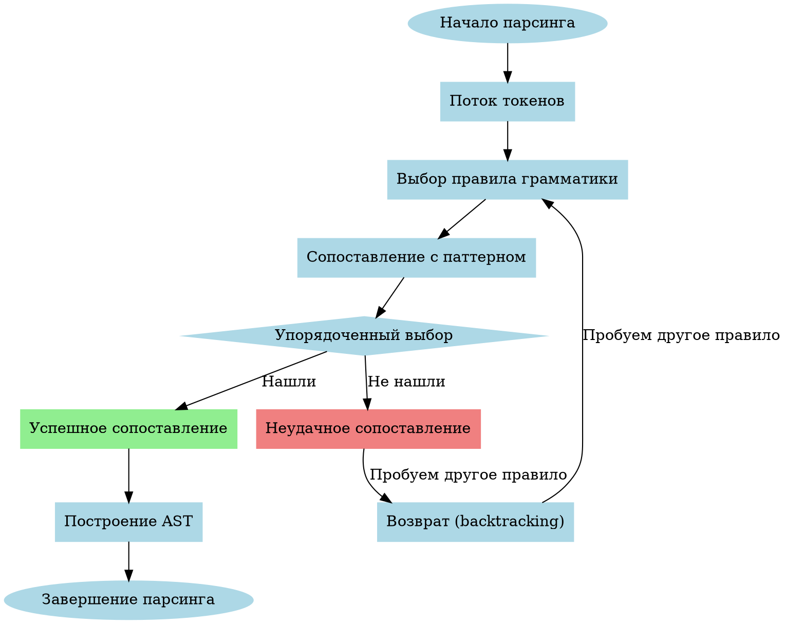
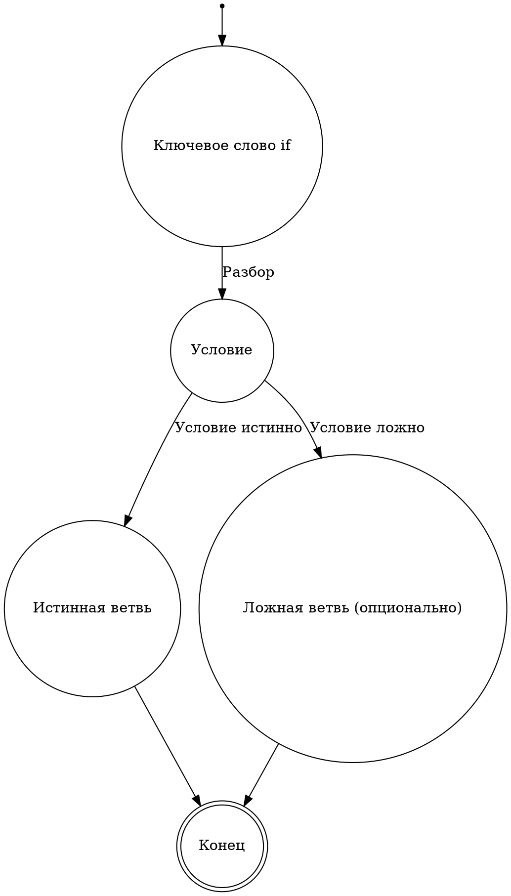
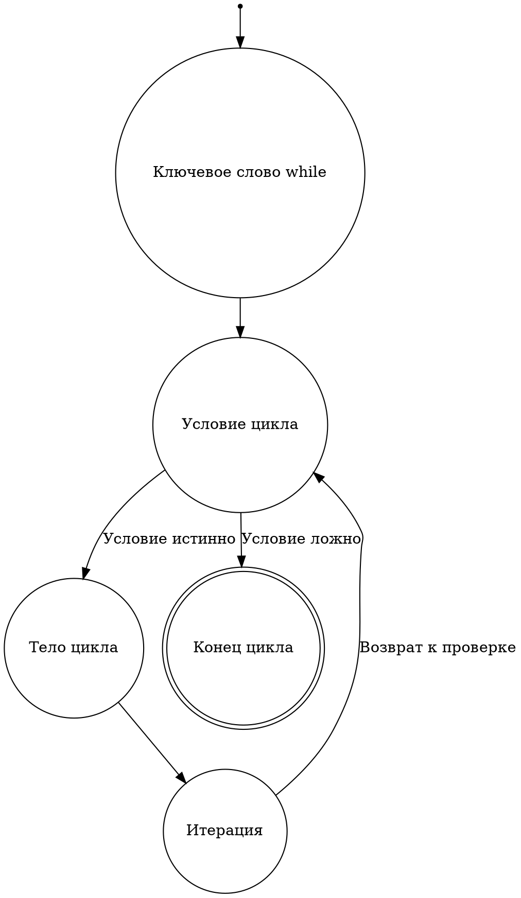

# Парсер компилятора: Подробное руководство

## 📚 Глоссарий ключевых терминов

| Термин | Определение |
|--------|-------------|
| **Парсер** | Компонент компилятора, преобразующий последовательность токенов в абстрактное синтаксическое дерево. |
| **PEG** | Parsing Expression Grammar - формальная грамматика для описания синтаксического анализа. |
| **Рекурсивный спуск** | Техника парсинга, основанная на взаимных рекурсивных вызовах функций для каждого нетерминального символа грамматики. |
| **Упорядоченный выбор** | Механизм в PEG, при котором альтернативы рассматриваются в порядке их определения (в отличие от КС-грамматик). |
| **Синтаксический анализ** | Процесс определения структуры входных данных согласно формальной грамматике. |
| **Грамматика** | Формальное описание синтаксиса языка программирования. |
| **Дерево разбора** | Древовидная структура, отражающая синтаксическую структуру входной строки согласно грамматике. |
| **Приоритет операторов** | Правила, определяющие порядок выполнения операций в выражениях. |
| **Ассоциативность** | Правило, определяющее порядок выполнения операторов с одинаковым приоритетом. |
| **Нетерминальный символ** | Элемент грамматики, который может быть заменен согласно правилам грамматики. |

## 🔄 Место парсера в процессе компиляции

### Визуальный поток компиляции

```dot
digraph CompilationPipeline {
    rankdir=LR;
    node [shape=box, style=filled, color=lightblue];
    
    source [label="Исходный код\nint main() { return 42; }"];
    lexer [label="Лексический анализатор"];
    parser [label="Синтаксический\nанализатор (Парсер)", color=gold, style=filled];
    ast [label="Абстрактное\nСинтаксическое Дерево"];
    semantic [label="Семантический\nанализатор"];
    optimization [label="Оптимизация"];
    codegen [label="Генерация кода"];
    
    source -> lexer [label="Символы"];
    lexer -> parser [label="Токены"];
    parser -> ast [label="Создание AST", color=red, penwidth=2.0];
    ast -> semantic;
    semantic -> optimization;
    optimization -> codegen;
    
    subgraph cluster_parser {
        label="Внутренние компоненты парсера";
        style=dashed;
        color=gray;
        
        input [label="Входные токены", shape=ellipse];
        grammar [label="Правила грамматики"];
        parsing_engine [label="Механизм разбора"];
        tree_builder [label="Построитель AST"];
        output [label="Дерево AST", shape=ellipse];
        
        input -> grammar -> parsing_engine -> tree_builder -> output;
    }
}
```



### Схема процесса парсинга

```
┌───────────────────────────────────┐
│ Входные токены:                   │
│ [KW:int] [ID:main] [(] [)] [{] ... │
└───────────────┬───────────────────┘
                ▼
┌───────────────────────────────────┐
│ Синтаксический анализатор         │
└───────────────┬───────────────────┘
                ▼
┌───────────────────────────────────┐
│ Абстрактное синтаксическое дерево │
│                                   │
│          Program                  │
│             │                     │
│          Function                 │
│          /  │  \                  │
│       int  main  Block            │
│                    │              │
│                  Return           │
│                    │              │
│                   42              │
└───────────────────────────────────┘
```

## 📝 Пошаговое руководство для начинающих разработчиков

### Базовые концепции на простых примерах

1. **Что такое парсинг?**
   
   Представьте, что вы разбираете предложение на русском языке:
   ```
   "Студент читает книгу."
   ```
   
   Ваш мозг разбивает его на части:
   - Подлежащее: "Студент"
   - Сказуемое: "читает"
   - Дополнение: "книгу"
   
   Парсер делает то же самое с кодом!

2. **От токенов к структуре**

   Пример с простым арифметическим выражением:
   ```
   2 + 3 * 4
   ```
   
   Токены: `[2]` `[+]` `[3]` `[*]` `[4]`
   
   Правильная структура (AST):
   ```
        +
       / \
      2   *
         / \
        3   4
   ```

3. **Как работает парсер?**

   - Получает токены от лексера
   - Применяет правила грамматики
   - Строит дерево разбора
   - Преобразует его в AST

### Практический пример для новичков

#### Исходный код
```clojure
(defn parse-simple-expression [tokens]
  (let [left (parse-number (first tokens))
        op (second tokens)
        right (parse-number (nth tokens 2))]
    {:type :expression
     :operator op
     :left left
     :right right}))
```

#### Пошаговый разбор
1. Берем токены: `[2]` `[+]` `[3]`
2. Парсим левое число: `{:type :number, :value 2}`
3. Извлекаем оператор: `+`
4. Парсим правое число: `{:type :number, :value 3}`
5. Создаем узел выражения

#### Результат
```clojure
{:type :expression
 :operator "+"
 :left {:type :number, :value 2}
 :right {:type :number, :value 3}}
```

## 🧠 Обзор архитектуры парсера

### Основные концепции
- **Тип парсера**: Parsing Expression Grammar (PEG)
- **Язык реализации**: Clojure
- **Цель**: Преобразование токенов в абстрактное синтаксическое дерево (AST)

### Упрощенная модель работы PEG-парсера



## 📦 Структура модуля

### Ключевые пространства имен
```clojure
(ns compiler.parser
  (:require [clojure.string :as str]
            [compiler.ast :refer [->Num ->BinaryOp ...]])
```

### Основные компоненты
1. **Вспомогательные функции**
   - `match-token`: Проверка токенов
   - `match-type`: Проверка типа токена
   - `match-value`: Проверка значения токена

2. **Парсинг примитивов**
   - `parse-number`: Разбор числовых литералов
   - `parse-variable`: Разбор переменных
   - `parse-parens`: Разбор выражений в скобках

3. **Парсинг операторов**
   - `parse-binary-op`: Бинарные операции
   - `parse-unary-op`: Унарные операции

4. **Парсинг управляющих конструкций**
   - `parse-if`: Условные операторы
   - `parse-while`: Циклы while
   - `parse-for`: Циклы for
   - `parse-return`: Операторы возврата

## 🔍 Алгоритм работы парсера

### Этап 1: Лексический анализ
```clojure
(defn parse [input]
  (let [tokens (filterv 
                 (fn [token] 
                   (not (or 
                          (= (first token) :comment)
                          (= (first token) :whitespace)
                          (= (first token) :comment_multiline))))
                 (tokenize input))]
    ;; Дальнейшая обработка токенов
    ))
```

#### Шаги лексического анализа
1. Преобразование входной строки в поток токенов
2. Фильтрация служебных токенов (комментарии, пробелы)

### Этап 2: Синтаксический анализ
```clojure
(defn parse-statement [tokens]
  (or (parse-if tokens)
      (parse-while tokens)
      (parse-for tokens)
      (parse-return tokens)
      (parse-block tokens)
      (parse-expr tokens)))
```

#### Стратегия разбора
- Рекурсивный спуск
- Упорядоченный выбор (ordered choice)
- Последовательная проверка правил парсинга

### Этап 3: Построение AST
```clojure
(defn parse-complex-expr [tokens]
  ;; Сложный алгоритм построения AST
  ;; Обработка приоритета операторов
  )
```

## 🎓 Математическая модель парсера

### Формальное определение PEG-грамматики

\[ 
\text{PEG} = (V, \Sigma, R, e_s)
\]

где:
- \( V \) - конечное множество нетерминальных символов
- \( \Sigma \) - конечное множество терминальных символов, \( V \cap \Sigma = \emptyset \)
- \( R: V \rightarrow \mathcal{E} \) - конечное множество правил
- \( e_s \in \mathcal{E} \) - выражение разбора, обозначаемое стартовым символом

### Операторы в PEG

| Оператор | Описание | Математическая нотация |
|----------|----------|------------------------|
| Последовательность | Сопоставление e₁, затем e₂ | \( e_1 \cdot e_2 \) |
| Упорядоченный выбор | Пробуем e₁, если не получилось - e₂ | \( e_1 / e_2 \) |
| Замыкание Клини | Ноль или более вхождений e | \( e* \) |
| Позитивное замыкание | Одно или более вхождений e | \( e+ \) |
| Опциональное вхождение | Ноль или одно вхождение e | \( e? \) |
| И-предикат | Проверяет наличие e без потребления | \( \&e \) |
| Не-предикат | Проверяет отсутствие e без потребления | \( !e \) |

### Время работы и сложность

Временная сложность PEG-парсера без мемоизации:
\[ O(4^n) \]

Временная сложность PEG-парсера с мемоизацией:
\[ O(n^3) \]

Где \( n \) - длина входной строки.

Пространственная сложность:
\[ O(n^2) \]

## 🔄 Диаграммы конечных автоматов для управляющих структур

### 1. Конечный автомат для if-else



### 2. Конечный автомат для while



## 🌲 Бонус: Полезные диаграммы для понимания

### Сравнение типов парсеров

```
LL  ──────────────────────  LR
↑                            ↑
Сверху-вниз                  Снизу-вверх
Рекурсивный спуск            Таблицы переходов
Проще для понимания          Более мощные
PEG относится сюда           LALR относится сюда
```

### Лестница сложности парсеров

```
Сложность   │         ┌───────┐
реализации  │         │  LR   │
            │         │       │
            │    ┌────┴──┐    │
            │    │ LALR  │    │
            │    │       │    │
            │ ┌──┴────┐  │    │
            │ │  LL   │  │    │
            │ │       │  │    │
            │ └──┬───┐│  │    │
            │    │PEG││  │    │
            │    │   ││  │    │
            └────┴───┴┴──┴────┘
               Выразительность
```

### Ключевые шаги освоения
1. ✅ Изучите базовую теорию формальных грамматик
2. ✅ Реализуйте простой парсер для арифметических выражений
3. ✅ Научитесь обрабатывать приоритет операторов
4. ✅ Расширьте парсер для поддержки переменных
5. ✅ Добавьте поддержку управляющих конструкций

## 📚 Рекомендуемая литература
1. "Parsing Techniques" - Dick Grune
2. "Modern Compiler Implementation" - Andrew W. Appel
3. "Language Implementation Patterns" - Terence Parr

## 🔗 Ссылки на исходный код

- [GitHub: Clojure Compiler Project](https://github.com/Sehktel/compiler)
- [Документация проекта](https://Sehktel.github.io/compiler-docs)

---

**Замечание для начинающих**: Парсинг - это не просто техническая задача, но искусство трансформации абстракций. Не бойтесь экспериментировать и постепенно наращивать свои знания! 🚀